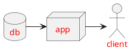

[❖] *Alpine Trails* Requirements
================================
<base href="https://github.com/jr-grenoble/rando/blob/master#❖" target="_self">

This description of the requirements and [specifications] for
*[alpine trails][alpinetrails]*, a site dedicated to hiking in the Alps.

The site is available at <https://alpinetrails.factshaven.com> and is hosted by
[Facts Haven][factshaven], a company dedicated to presenting facts in a clear
and intelligible way. In turn, Facts Haven relies on Google services, namely
[Google sites][sites] to format content and update it.
As *sites* only deal with static data and imposes a format, there's no complex
CSS nor javascript to be maintained. However, the site embeds interactive experiences
from external suppliers.

These specifications are structured as follows:

1. [Site Organization](#❖-site-organization)
2. [Topo Preparation](#❖-topo-preparation)
3. [Images and Icons](#❖-images-and-icons)
4. [External Dependencies](#❖-external-dependencies)

The [appendix](#❖-appendix) contains further information:
1. [Compass](#❖-compass): a full description of our SVG compass
2. [Dev tools](#❖-dev-tools): highly useful development tools
3. [HTML tags](#❖-html-tags): underrated but useful HTML tags


Our [markdown tools](#-markdown-tools) list the various utilities used to write [markdown] text.
The symbol [❖] that you'll find at the end of each section allows you to navigate to
the top of the document (except in the Atom previewer, as it doesn't support local links).

[❖]: # (go to top)
[alpinetrails]: https://alpinetrails.factshaven.com (alpine trails)
[factshaven]: http://www.factshaven.com/ (factshaven web site)
[sites]: https://sites.google.com/new (google sites)


[❖] Site Organization
=====================

RESTART HERE (site)

[❖] Site Map
------------

⚠️ Describe page tree and links ⚠️

[❖] Topo Pages
--------------

⚠️ Describe page structure for each hike ⚠️
*   QR code
*   Pointer to waze
*   Pointer to meteoblue (embed?)
*   Pointer to visorando
*   pointers to other sites

[❖] Outing Pages
----------------
⚠️ Describe outing pages ⚠️
These pages contain the story about a particular outing.
This is where you find the most pictures (or links to).


[❖] Global Pages
----------------

⚠️ Describe all other pages; these include: ⚠️
*   Global map pointing to all topos
*   The user guide (difficulty ranking, durations, pictograms)
*   Terms and conditions
*   Advice (equipment)
*   Videos to include (see https://stackoverflow.com/questions/2068344/how-do-i-get-a-youtube-video-thumbnail-from-the-youtube-api)
    *   How to coil and carry a rope https://youtu.be/PD6jYQobGXU
    *   Snow walking with a ice axe https://youtu.be/BStGfLMHaS8
    *   Ice xe arrest https://youtu.be/94QFImjdEAo or https://youtu.be/QN58FtFy7dU
    *   Abseiling in snow https://youtu.be/GYr8jTbpeXk
    *   Belaying in slope https://youtu.be/MZh-NgnyBHo
    *   Using crampons https://youtu.be/NQ_WsqrP6us
    *   Self rescue with prussiks https://youtu.be/E6Mbl1QiQ_E
    *   Advanced rappel techniques https://youtu.be/0qgygg8pzGI [](https://youtu.be/0qgygg8pzGI)
    *   Advanced glacier travel techniques https://youtu.be/igWCe0RZvBs
    *   See more at https://www.objectif-montagne.ch/2019/05/

[❖] Topo Preparation
====================

⚠️ Describe what to do before and after hiking ⚠️


[❖] Naming Conventions
----------------------

To keep things organized we have specific conventions for file names.
We make extensive use of [tiny URL] along with custom aliases to generate friendlier addresses.
⚠️ Explain *hike* vs *-hike* vs *Hike*  vs *HIKE* as well as dashed names and waypoint and date conventions.
⚠️ Explain that the files must be stored in personnal space, not Facts Haven.

| tool            | purpose                               | tiny | naming                                   | how to                                      |
|-----------------|---------------------------------------|:----:|------------------------------------------|---------------------------------------------|
| [ayvri]         | 3d animated rendition of the GPX      |   ✅  | video-jrb-*hike*                         | [❖3d video](#❖-3d-video)                    |
| [google drive]  | backup for compass SVG files          |   ❌  | compass-*CCC*                            |                                             |
| [google drive]  | backup for dashboard SVG files        |   ❌  | dash-jrb-*hike*                          |                                             |
| [google photos] | online photo albums                   |   ❌  | *yyyy-mm-dd* *hike*                      | [❖photos](#❖-photos)                        |
| [google photos] | online pictures                       |   ❌  | *nn*：*title*                            | [❖photos](#❖-photos)                        |
| [ma carte ign]  | [geoportail] topographic map and path |   ✅  | ign-jrb-*hike*                           | [❖ hiking map](❖-hiking-map)                |
| [meteoblue]     | 3-hourly weather forecast             |   ✅  | 3h-jrb-*place*                           | [❖ weather forecast](❖-weather-forecast)    |
| [meteoblue]     | 5 day weather forecast                |   ✅  | 5d-jrb-*place*                           | [❖ weather forecast](❖-weather-forecast)    |
| [peakfinder]    | interactive view of named peaks       |   ✅  | peak-jrb-*place*                         | [❖peak finder](❖-peak-finder)               |
| [slopes]        | IGN map with slopes                   |   ✅  | geo-jrb-*hike*                           | [❖ hiking map](❖-hiking-map)                |
| [streetview]    | 4π sr panoramas on Google maps        |   ✅  | 4pisr-jr-*place*                         | [❖4πsr panorama](❖-4πsr-panorama)           |
| [visorando]     | tentative route and indications       |   ❌  | TENTATIVE *HIKE*                         | [❖visorando](#❖-visorando)                  |
| [visorando]     | hike description                      |   ❌  | *Hike*                                   | [❖visorando](#❖-visorando)                  |
| [visugpx]       | GPX map and profile                   |   ❌  | *Hike*                                   | [❖gpx record](#❖-gpx-record)                |
| [visugpx]       | waypoint naming                       |   ❌  | [*nn*] *desc* (*tags*); ±*δδδ*m; *d.dd*km| [❖gpx record](#❖-gpx-record)                |
| [waze]          | driving directions                    |   ✅  | waze-jrb-*place*                         | [❖driving directions](❖-driving-directions) |
| [youtube]       | video instructions                    |   ❌  | youtubeid                                | [❖global pages](❖-global-pages)             |

[ayvri]: https://ayvri.com/profile/7dj2v816ke# (Ayvri 3d GPX rendering)
[carte des pentes]: https://www.geoportail.gouv.fr/donnees/carte-des-pentes (Geoportail hidden slope gradients)
[geoportail]: https://www.geoportail.gouv.fr (Geoportail)
[google drive]: https://drive.google.com/ (Google drive)
[google photos]: https://photos.google.com/ (Google photo albums)
[ma carte ign]: https://macarte.ign.fr/mon-compte/ (IGN custom maps)
[meteoblue]: https://www.meteoblue.com (meteoblue main page)
[peakfinder]: https://www.peakfinder.org (Peak Finder interactive summit locator)
[streetview]: https://www.google.com/maps/contrib/ (Google maps streetview pictures - go to "photos")
[slopes]: https://www.geoportail.gouv.fr/donnees/carte-des-pentes (Geoportail slopes)
[tiny URL]: https://tinyurl.com/ (tiny URL shortener)
[visorando]: https://www.visorando.com (Visorando)
[visugpx]: https://www.visugpx.com/membres/48090/ (VisuGPX)
[waze]: https://www.waze.com (Waze driving directions)
[youtube]: https://www.youtube.com (YouTube videos)

[❖] Before Hiking
-----------------

Before hiking, we must prepare our gear and study documentation about the area we plan to explore.
In case we explore a new route, we also need to sketch it so that it displays on our GPS.

### [❖] Study documentation first ###

Investigate the following sites:

*   [x] the excellent [Altituderando] topos (in French)
*   [x] les magnifiques randonnées d'[Antoine Salvi] (in French)
*   [x] the multilingual [CampToCamp] reference
*   [x] Grenoble's [maison de la montagne] (in French)
*   [x] Pascal [Sombardier]'s topos (in French)
*   [x] lthe wonderful [sentier nature] (in French)
*   [x] for Switzerland, [Swiss Rando] (in official Swiss languages)
*   [x] around Valloire, [Valloire Rando] (in French)
*   [x] hiking and climbing books
*   [x] and of course [Visorando] (in French)

### [❖] Prepare itinerary next ###

Sketch and schedule itinerary:

*   [x] use the [visorando] map creation tools to sketch route under a temporary name : TENTATIVE HIKE NAME
*   [x] check slope gradients on IGN's [carte des pentes] combined with [geoportail], cf. [hike map](#❖-hike-map) explanations
*   [x] download map tiles for IGN, photo and openstreetmap (rando) in the visorando application
*   [x] record starting point (lat,long) in [waze] and compute driving time
*   [x] check the [meteoblue] weather forecast including sunrise and determine wake up time
*   [x] enter [visorando] route and starting point in shared agenda
*   [x] set alarm clock and tell partner about hike


### [❖] Prepare equipment last ###

Pack the right equipment :

*   [x] charge devices:
    +   [x] phone
    +   [x] headlamp
    +   [x] power packs
    +   [x] headsets
*   [x] based on [meteoblue], and terrain determine extra equipment:
    +   [x] gaiters
    +   [x] crampons (and antibot in case of snow)
    +   [x] helmet
    +   [x] piolet (2 for steep slopes)
    +   [x] headlamp (if no full moon or overcast)
    +   [x] hat (sun)
    +   [x] down jacket
    +   [x] gloves
    +   [x] rope, harness, slings, descender, krabs… in case of anticipated abseiling
    +   [x] bivouac equipment (tent or bivy, mat, down, stove)
    +   [x] hot drink
    +   [x] sticks (carbon with piolets, metallic otherwise)
*   [x] add standard equipment (in waterproof bags):
    +   [x] climbing boots
    +   [x] two pairs of socks (vs. blisters)
    +   [x] climbing pants
    +   [x] climbing shirt
    +   [x] extra t-shirt (in back pack)
    +   [x] fleece
    +   [x] softshell
    +   [x] rain jacket
    +   [x] mitts
    +   [x] beanie
    +   [x] buff
    +   [x] sun screen
    +   [x] emergency equipment (band aid, antiseptic, life blanket, cord, duct tape, bandana)
    +   [x] filter
    +   [x] knife, spoon and small multi-tool
    +   [x] sun and reading glasses
    +   [x] water (bottle or camelback)
    +   [x] food and snacks (favor protein, cereals)
    +   [x] id and wallet
*   [x] load equipment in back pack, carrying box and car


[altituderando]: https://www.altituderando.com/ (Altituderando)
[antoine salvi]: http://antoine.salvi.free.fr/ (Antoine Salvi)
[camptocamp]: https://www.camptocamp.org/ (CampToCamp multilingual site)
[maison de la montagne]: http://www.grenoble-montagne.com (Grenoble maison de la montagne)
[sentier nature]: https://www.sentier-nature.com/montagne/ (Gérard Barré et Antoine Salvi)
[sombardier]: http://www.pascal-sombardier.com (Pascal Sombardier's topos)
[swiss rando]: https://www.randonner.ch/fr/home (Swiss Rando)
[valloire rando]: http://www.valloire-randos.fr (randonnées autour de Valloire)


[❖] After Hiking
----------------

Once a hike is over, we need to record it.

⚠️ RESTART HERE (conventions and steps!)⚠️

-   [x] Upload GPS track into Visorando
    *   [ ] Rename the new topo with its hike name
    *   [ ] Record important steps in the description section
-   [x] Transfer pictures
    *   [ ] Eliminate duplicates
    *   []


[❖] Images and Icons
====================

⚠️ RESTART HERE (icon directory)⚠️

[❖] External Dependencies
=========================

We always keep a list of dependencies in requirements and specifications, going from
specific to generic, thus ending with those for markdown.

[❖] Online Resources
--------------------

The *alpine trail*  site relies on a number of external sites to display content.
As already stated, it is based on Google [sites] and thus limited by the capabilities
of that service. However, *sites* allows for embeding full html (in frames), which gives
significant flexibility. We use this to embed several kinds of diagrams.

### [❖] QR Code ###

Each hike contains the QR code referring to its own page, so that it can be easily retrieved from printouts.

To generate QR codes, we rely on the [TEC-IT] online QR code generator and we pass the corresponding URI
to [sites] as that of an online image.

The syntax for the image URI is:  
`https://qrcode.tec-it.com/API/QRCode?data=<data>&color=%23<hexcolor>&backcolor=%23<hexcolor>&size=<size>`.

As the `<data>` fragment must be URI encoded, we can use the online [url encode] tool to create it,
or enter the data as raw data in the [TEC-IT] online tool.
The `<hexcolor>` values are 6 digits hexadecimal codes. We can add a `&istransparent=true` fragment
instead of the backcolor, to make the QR code blend with the background.
We use the site color for foreground (`a30015`).

The `<size>` can be either `small`, `medium` or `large`.
A few other options are available, see the [TEC-IT] site for more.

For instance, the following URI encodes the QR code pointing to the hikes template page
(we have added a quietzone fragment to get a white border around the code):

>   https://qrcode.tec-it.com/API/QRCode?data=https%3A%2F%2Fsites.google.com%2Ffactshaven.com%2Falpinetrails%2Fhikes%2Ftemplate&color=%23a30015&backcolor=%23ffffff&size=small&quietzone=1
>
>   


[tec-it]: https://qrcode.tec-it.com/en (Tex-IT online QR code generator)
[url encode]: https://www.url-encode-decode.com/ (online URI encoder and decoder)

### Global Map ###

⚠️ RESTART HERE (geo tools and photos) (only use frames when necessary, explain trick to set width to 100%).⚠️


### [❖] GPX Record ###

⚠️ Process GPX with atom after [visorando] editing. Name file as gpx-jrb-hike.
Use [VisuGPX] to create a map and altimetric profile.

Use iframe (not link) and &iframe&otm&impression in [VisuGPX] to avoid scroll bars

Preprocess GPX data (remove time tags and replace creator by creator="ⓒ Jean-René Bouvier"),
normalize waypoints as `<name>[nn] desc (tags)</name><desc>±deniv; distance</desc>` where nn is the sequential numner,
optional tags are a symbol (o, •, -, +, =, x) followed by a color,
deniv is the Δ from the starting point (m) and distance is measured in km also from the starting point.

Remove time (regexp in vi: s/<time>[^<]+</time>\s*\n//g).

IBP analyzis: https://www.ibpindex.com for speed in movement, time in movement…

### [❖] Hiking Map ###
Hiking maps are coming from the [geoportail] site.
⚠️  explain how to indicate slopes (carte des pentes), layers…; use [ma carte ign] to generate a good looking map with
proper path color (can't do it in geoportail); use [geoportail] to indicate slope gradients.

Set copyright to &copy; <a href="mailto:contact@factshaven.com" title="&copy; Jean-Ren&eacute Bouvier" >Jean-René Bouvier</a>

>   https://www.geoportail.gouv.fr/embed/visu.html?c=5.7117972163988,45.31541199150999&z=15&l0=GEOGRAPHICALGRIDSYSTEMS.MAPS.SCAN25TOUR.CV::GEOPORTAIL:OGC:WMTS&l1=ORTHOIMAGERY.ORTHOPHOTOS::GEOPORTAIL:OGC:WMTS&d2=2087827&permalink=yes)
>
> <!-- The iframe that follows is displayed by the markdown viewer, but ignored by other markdown parsers -->
>
>   <iframe width="600" height="400" frameborder="0" scrolling="no" marginheight="0" marginwidth="0" sandbox="allow-forms allow-scripts allow-same-origin" src="https://www.geoportail.gouv.fr/embed/visu.html?c=5.7117972163988,45.31541199150999&z=15&l0=GEOGRAPHICALGRIDSYSTEMS.MAPS.SCAN25TOUR.CV::GEOPORTAIL:OGC:WMTS(1)&l1=ORTHOIMAGERY.ORTHOPHOTOS::GEOPORTAIL:OGC:WMTS(1;h)&d2=2087827(1)&permalink=yes" allowfullscreen></iframe>
>
> <!-- end of iframe  -->


### [❖] Map Steps ###

### [❖] 3d Video ###

Explain how to use [ayvri] with proper GPX track.

### [❖] 4πsr Panorama ###

When going to [streetview], make sure to be logged as private contributor (gmail address) and go to *photos* to see
contributions.

We use [streetview] to record 4πsr pictures and share them with the world. We use [tinyURL] to then create a shorter
URI to the picture, named as *4pisr-jr-place* where *place* is the dashed name of the place the picture is taken from
(typically a peak name).

### [❖] Driving Directions ###

Waze: https://www.waze.com/ul?ll=44.935558%2C6.19969&navigate=yes&zoom=17
escape ampersands within SVG

https://www.waze.com/ul?ll=45.15616%2C5.619211&navigate=yes&zoom=17

### [❖] Peak Finder ###

We use [tinyURL] to create a shorter
URI to the view, named as *peak-jr-place* where *place* is the dashed name of the place the peaks are viewed from
(typically a peak name).
E.g. https://www.peakfinder.org/?lat=45.3131&lng=5.6965&azi=248&zoom=5&ele=1861&name=Rocher%20de%20Lorzier

### [❖] Photos ###
Explain how to set up albums in Apple Photos and [Google Photos] and what to put in the topo photo
gallery vs in the outings (peak views, orientation pictures…), how to name photos and albums, what to
put in visorando, what to put in system pictures, how to share.

Explain also how to handle private pictures (i.e. with identifiable people).

### [❖] Visorando ###

Record my guidelines
Describe process (modify track in anonymous recorded track, name waypoints as "new - desc", download GPX,
    remove useless waypoints; rename waypoints nn: desc; ±δδδm; d.dkm (hhhhm),
remove time, name GPS file as gpx-jrb-hike, upload sanitized GPX in VisuGPX, upload sanitized GPX in new rando, remove extra information in visorando waypoints, delete anonymous recorded track and TENTATIVE, write summary, upload pictures, start describing.

Start description by pointing to parking in *informations pratiques*

Emojis to use in *informations pratiques* and text examples.

*   🅿️ Se garer au parking du chalet de la Charmette, N 45.324794° / E 5.739136°. En cliquant sur le lien Google ou Waze, vous pouvez directement entrer ces coordonnées dans votre application de navigation favorite. Du Col de la Charmette, un chemin carrossable mène au parking du chalet.

*   💧L'eau n'est pas très abondante, comme souvent en Chartreuse mais elle est présente dans le talweg de la prairie de Vararey (filtre indispensable).

*   🐶 Les chiens sont généralement interdits en alpages du 15 juin au 15 octobre (cf. le site du parc), mais celui des Bannettes semble faire exception. Pour que cette exception se prolonge, tenir son chien en laisse à proximité des troupeaux et autres promeneurs.

*   🧗‍♀️La difficulté de cette randonnée est à la limite supérieur du niveau «moyen». En cas de neige, elle est «difficile».

*   🏕 La randonnée est courte et ne se prête pas au bivouac sauf si l'on veut assister à un lever du soleil depuis les cimes. Celle du Rocher de Chalves est la plus confortable.

*   🥾L'équipement classique du randonneur est suffisant. En cas de neige, cf. les photos, les crampons peuvent être utiles pour les 2 sommets.

*   🧭 L'orientation est facile une fois sorti des bois. En forêt, le GPS — ou bien sûr l'application Visorando — est conseillé pour monter au Goulet d'Hurtières sans se tromper.

*   ⚠️ Attention, la route menant au col est fermée en hiver et début de saison au-dessus de Pomarey. Dans ce cas, la randonnée est plus longue de quelques kilomètres. Il est possible de descendre de la route à pied pour franchir le Tenaison, et de remonter à vue, mais les pentes sont extrêmement raides et glissantes.

Emojis to use in *pendant la rando ou à proximité* and text examples.

*   🐼 La faune des alpages est présente partout (marmottes, chamois…). Un important troupeau de mouflons loge fréquemment entre le Col de la Petite Vache (plus au Nord) et le Col d'Hurtières.

*   📷 Les points de vue depuis les 2 sommets et les cols sont magnifiques. Cf. cette photo interactive.

*   🗺 Plusieurs variantes sont possibles. Si l'on est pressé, il suffit de redescendre du Rocher de Lorzier jusqu'au pré de Vararey en coupant dans les pentes. Si l'on a un peu plus de temps, il est possible de monter à la Grande Sure par son arête Sud (attention, nettement plus difficile que l'arête Sud du Rocher de Lorzier, la randonnée passe alors en Très Difficile).

### [❖] Weather Forecast ###

The best source of weather forecast is [meteoblue]. They provide [forecast widgets] to display
weather conditions with different granularity:

1.  one presenting [daily forecast] values
2.  one presenting [3-hourly forecast] values

We can use the widget configuration pages to experiment with settings, but they generate iframes that
do not display very well in [sites]. The best is actually to embed the widgets using their plain URIs.

For both widgets, the syntax is:  
`https://www.meteoblue.com/en/weather/widget/<widget><lat><long>?geoloc=fixed&days=<n>[&<option>]*`.

Here are examples of fragment values

| fragment   |  daily | 3-hourly | comment                                          |
|------------|-------:|---------:|--------------------------------------------------|
| `<widget>` |  daily |    three | There's also a seeing widget for star watchers   |
| `<lat>`    |45.678N | -30.671N | South latitudes are indicated  as negative North |
| `<long>`   | 5.673E | -65.432E | West longitude are indicated as negative East    |
| `<n>`      |      5 |        7 | Value must be ∈ {4,5,6,7}                        |

On top of the number of days `<n>`, the daily widget takes the following options:

| option                   |     possible values | recommended value                                |
|--------------------------|:-------------------:|--------------------------------------------------|
| precipunit               |     INCH¦MILLIMETER | MILLIMETER (of course!)                          |
| tempunit                 |  CELSIUS¦FAHRENHEIT | CELSIUS (of course!)                             |
| windunit| KILOMETER_PER_HOUR¦<br />METER_PER_SECOND | METER_PER_SECOND (of course!)               |
| layout                   |          light¦dark | light (white background + black text)            |
| coloured                 | coloured¦monochrome | monochrome (avoid color distraction)             |
| pictoicon                |                 0¦1 | 1 (show weather icon)                            |
| maxtemperature           |                 0¦1 | 1 (show max temperature for the day)             |
| mintemperature           |                 0¦1 | 1 (show min temperature for the day)             |
| windspeed                |                 0¦1 | 1 (show average wind speed for the day)          |
| windgust                 |                 0¦1 | 1 (show max wind gust for the day)               |
| winddirection            |                 0¦1 | 1 (show average wind direction for the day)      |
| uv                       |                 0¦1 | 1 (show max UV index for the day)                |
| humidity                 |                 0¦1 | 1 (show max relative humidity index for the day) |
| precipitation            |                 0¦1 | 1 (show icon + precipitation amount for the day) |
| precipitationprobability |                 0¦1 | 1 (show precipitation probability for the day)   |
| spot                     |                 0¦1 | 0 (hide rain spot 35km radar)                    |
| pressure                 |                 0¦1 | 1 (indicate average pressure in hPa)             |

For instance, the URI to display 5 days of daily forecast for the Grand Veymont (44.867ºN, 5.527ºE)
would thus be:

>   https://www.meteoblue.com/en/weather/widget/daily/44.867N5.527E?geoloc=fixed&days=5&tempunit=CELSIUS&windunit=METER_PER_SECOND&precipunit=MILLIMETER&coloured=monochrome&pictoicon=1&maxtemperature=1&mintemperature=1&windspeed=1&windgust=1&winddirection=1&uv=1&humidity=1&precipitation=1&precipitationprobability=1&pressure=1&layout=light
>
> <!-- The iframe that follows is displayed by the markdown viewer, but ignored by other markdown parsers -->
>
>   <iframe src="https://www.meteoblue.com/en/weather/widget/daily/44.867N5.527E?geoloc=fixed&days=5&tempunit=CELSIUS&windunit=METER_PER_SECOND&precipunit=MILLIMETER&coloured=monochrome&pictoicon=1&maxtemperature=1&mintemperature=1&windspeed=1&windgust=1&winddirection=1&uv=1&humidity=1&precipitation=1&precipitationprobability=1&pressure=1&layout=light"  frameborder="0" scrolling="NO" allowtransparency="true" sandbox="allow-same-origin allow-scripts allow-popups allow-popups-to-escape-sandbox" style="width: 380px;height: 380px">Iframe in the markdown source</iframe>
>
> <!-- end of iframe  -->

On top of the number of days `<n>`, the 3-hourly widget takes the following options:

| option     |                          possible values | recommended value                      |
|------------|-----------------------------------------:|----------------------------------------|
| nocurrent  |                                      0¦1 | 1 (do not show current weather on top) |
| noforecast |                                      0¦1 | 0 (show forecast)                      |
| tempunit   |                       CELSIUS¦FAHRENHEIT | CELSIUS (of course!)                   |
| windunit   | KILOMETER_PER_HOUR¦KNOT¦METER_PER_SECOND | METER_PER_SECOND (of course!)          |
| layout     |             bright¦dark¦image¦monochrome | bright (white background + black text) |

For instance, the URI to display 5 days of 3-hourly forecast for the Grand Veymont (44.867ºN, 5.527ºE)
would thus be:

>   https://www.meteoblue.com/en/weather/widget/three/44.867N5.527E?geoloc=fixed&days=5&nocurrent=1&noforecast=0&tempunit=CELSIUS&windunit=METER_PER_SECOND&layout=bright
>
> <!-- The iframe that follows is displayed by the markdown viewer, but ignored by other markdown parsers -->
>
>   <iframe src="https://www.meteoblue.com/en/weather/widget/three/44.867N5.527E?geoloc=fixed&days=5&nocurrent=1&noforecast=0&tempunit=CELSIUS&windunit=METER_PER_SECOND&layout=bright"  frameborder="0" scrolling="NO" allowtransparency="true" sandbox="allow-same-origin allow-scripts allow-popups allow-popups-to-escape-sandbox" style="width: 805px;height: 519px">Iframe in the markdown source</iframe>
>
> <!-- end of iframe  -->

⚠️  Note that the meteoblue terms and conditions mandate a backlink that refers to the forecast location.

With the previous Grand Veymont (44.867ºN, 5.527ºE) location, this backlink is:

>   https://www.meteoblue.com/en/weather/forecast/week/44.867N5.527E?utm_source=weather_widget&utm_medium=linkus&utm_content=daily&utm_campaign=Weather%2BWidget
>
> And it must display as:
> <a href="https://www.meteoblue.com/en/weather/forecast/week/44.867N5.527E?utm_source=weather_widget&utm_medium=linkus&utm_content=daily&utm_campaign=Weather%2BWidget">meteoblue</a>

[forecast widgets]: https://content.meteoblue.com/fr/modes-d-acces/widget (meteoblue forecast widgets)
[daily forecast]: https://www.meteoblue.com/en/weather/widget/setupday (meteoblue daily forecast widget)
[3-hourly forecast]: https://www.meteoblue.com/en/weather/widget/setupthree (meteoblue 3-hourly forecast widget)

[❖] Markdown Tools
------------------

[Markdown] is a simplified syntax to write manuals and specs.
You can refer to this [cheat sheet] for a quick overview of the syntax.
We use the [GFM] variant, i.e. the Github Flavored Markdown syntax that includes a
[tables extension] and [task lists], and also supports
[strikethrough].

### [❖] Markdown Tables ###
We use [markdown tables] to automatically generate tables such as the following:

| h1 | h2 | h3 | h4 | h5 |
|----|----|----|----|----|
| a1 | a2 | a3 | a4 | a5 |
| b1 | b2 | b3 | b4 | b5 |
| c1 | c2 | c3 | c4 | c5 |

The corresponding markdown syntax is:
> ```markdown
| h1 | h2 | h3 | h4 | h5 |
|----|----|----|----|----|
| a1 | a2 | a3 | a4 | a5 |
| b1 | b2 | b3 | b4 | b5 |
| c1 | c2 | c3 | c4 | c5 |
```

The [markdown tables] tool also allows for generating HTML, LaTeX, MediaWiki or plain text tables.

### [❖] Task Lists ###
[Task lists] are similar to plain bulleted lists, except you can indicate a status by placing an
`x` between brackets:
- [x] task 1
    * [x] subtask 1.1
        + [x] subsubtask 1.1.1
    * [ ] subtask 1.2
- [ ] task 2    

### [❖] Strikethrough Text ###
Striking through text is useful to indicate deletion. This is achieved by enclosing the text
within double tildas ~. For instance this ~~chunk of text~~ is crossed out. Be careful using
real tildas: this ˜˜chunk˜˜ of text is not struck through, because «˜» ≠ «~».

### [❖] Code Snipets ###
By default, code excerpts have automatic syntax highlighting when you provide the language,
e.g. javascript in the example below:
```javascript
if ( "hello" === instanceof ( "world" ) ) {
    console.log ( 1 );
    }
else {
    other ();
    }
```
If you omit the language, the code is not highlighted:
```
if ( "hello" === instanceof ( "world" ) ) {
    console.log ( 1 );
    }
else {
    other ();
    }
```

### [❖] Diagrams ###
We create simple diagrams with the online [asciflow] tool and take care of enclosing them in
code blocks (triple backticks) to force line breaks. Here is an example:
```
some-directory/
├── dir_A
│   └── file_D
├── file_B
└── file_C
```

And here's another one:
```
+-----------------------------+
| Some text here.             |
|                             |
| The rest is on another line.|
+-----------------------------+
```

See also [UML diagrams](❖-UML) below, as they support online SVG URIs.

### [❖] Maths ###
Note that our Chrome markdown [viewer] can also render LaTeX equations, but [MathJax] is
**not** supported by [GFM] at this stage. Hence the following text renders well in the
Chrome markdown [viewer]:
> When \(a \ne 0\), there are two solutions to \(ax^2 + bx + c = 0\) and they are:
> $$x = \frac{-b \pm \sqrt{b^2-4ac}}{2a}$$

but it doesn't on *github* nor in *markdown preview* for Atom.
The trick is thus to use the [codecogs] LaTeX equation editor and generate image URIs
to embed equations in the text. The previous text would thus render as:
> When a ≠ 0, there are two solutions to ax² + bx + c = 0 and they are:  
>   <p style="text-align: center;">
>       
>   </p>

### [❖] Style ###
Note that you can introduce some level of styling in markdown, by using CSS &lt;style&gt;.
Such declarations are hoisted to the top and apply to the whole text. The [GFM] spec gives
you an idea of the generated HTML, you can thus fiddle a bit with it.
<style>
a {
    color: red!important;
    }
a:hover {
    font-weight: bold;
    }
</style>
This is how we have managed to make links appear in red (and bold when hovering) in this page:
```html
<style>
    a {
        color: red!important;
        }
    a:hover {
        font-weight: bold!important;
        }
</style>
```

## [❖] UML ###

The [PlantUML] syntax allows for drawing simple diagrams from textual descriptions:



Using the [PlantUML server] you can render such diagrams as SVG and get a corresponding URI
to embed it as images within your markdown text:


Refer to [PlantUML doc] to explore possibilities, in particular, all [PlantUML skin] parameters.

[asciflow]: http://asciiflow.com/ (simple ascii diagram editor)
[cheat sheet]: https://github.com/adam-p/markdown-here/wiki/Markdown-Cheatsheet (markdown summary)
[codecogs]: https://www.codecogs.com/latex/eqneditor.php (codegogs LaTeX equation editor)
[gfm]: https://github.github.com/gfm/ (github flavored markdown)
[markdown]: https://daringfireball.net/projects/markdown/syntax (markdown syntax)
[markdown tables]: https://www.tablesgenerator.com/markdown_tables (markdown table generator)
[mathjax]: https://www.mathjax.org/ (mathjax LaTeX renderer)
[plantuml]: http://plantuml.com/index (Plant UML tools)
[plantuml doc]: https://plantuml-documentation.readthedocs.io/en/latest/index.html (Plant UML documentation)
[plantuml server]: http://www.plantuml.com/plantuml/uml/SyfFKj2rKt3CoKnELR1Io4ZDoSa70000 (Plant UML online server)
[plantuml skin]: https://plantuml-documentation.readthedocs.io/en/latest/formatting/all-skin-params.html (Plant UML skin parameters)
[specifications]: https://tinyurl.com/factshaven-alpine-trails (google drive alpine trails specifications)
[strikethrough]: https://github.github.com/gfm/#strikethrough-extension- (github strikethrough)
[table extension]: https://github.github.com/gfm/#tables-extension- (github tables)
[task lists]: https://github.github.com/gfm/#task-list-items-extension- (github task lists)
[viewer]: https://github.com/simov/markdown-viewer#advanced-options (markdown viewer)
- - - - - - -
[❖] Appendix
============

[❖] Compass
-----------
The [compass] is an SVG image that we can overlay over maps to show a bearing.
⚠️ TODO: FIX SO THAT IT IS FLUSH WITH 0/0 coordinates! ⚠️


Whenever you want to create another bearing, you have to adjust a few parameters in
the file:

1.  you must adjust the CSS rotations, `--crot` and `--nrot` to the bearing angle.
    Note that you cannot define `--nrot` as `calc(- var(--crot))` at this stage of browser
    development (bug). These variables are defined in the CSS `:root` rule.
2.  you must also change the direction text that appears at the bottom of the compass
    (when oriented to the north) to reflect the new direction. You do this at the end
    of the SVG file, in the `#direction` group; e.g. `NNW` for `--crot = 22.5º`.
3.  you must also adjust the `x` position of that text, depending on the number of characters
    in the bearing; for a one-character bearing such as `W`, `x` must be 118, for a two-character
    bearing such as `NW`, `x` must be 106, and for a three-character bearing such as `ENE`, `x`
    must be 94.

These values are summarized here:

| bearing |  --crot |   --nrot |   x | bearing |   --crot |    --nrot |   x |
|:-------:|--------:|---------:|----:|:-------:|---------:|----------:|----:|
|    N    |    0deg |     0deg | 118 |    S    |   180deg |   -180deg | 118 |
|   NNE   | 22.5deg | -22.5deg |  94 |   SSW   | 202.5deg | -202.5deg |  94 |
|    NE   |   45deg |   -45deg | 106 |    SW   |   225deg |   -225deg | 106 |
|   ENE   | 67.5deg | -67.5deg |  94 |   WSW   | 247.5deg | -247.5deg |  94 |
|    E    |   90deg |   -90deg | 118 |    W    |   270deg |   -270deg | 118 |
|   ESE   |112.5deg |-112.5deg |  94 |   WNW   | 292.5deg | -292.5deg |  94 |
|    SE   |  135deg |  -135deg | 106 |    NW   |   315deg |   -315deg | 106 |
|   SSE   |157.5deg |-157.5deg |  94 |   NNW   | 337.5deg | -337.5deg |  94 |


The SVG code is:

```html
<svg
    xmlns="http://www.w3.org/2000/svg"
    viewbox="0 0 500 500">
    <!-- Use https://www.willpeavy.com/minifier/ to minify           -->
    <!-- When you change rotation (crot and nrot), change direction  -->
    <!-- To change direction, pick the right text and adjust x       -->
    <!-- E.g. for crot = 45deg, nrot = -45deg, x = 106 and text = NE -->
    <style media="all" type="text/css">
        :root {
            --crot: 22.5deg;
            --nrot: -22.5deg; /* Chrome bug: using a calc(- var(--crot)) does NOT work! */
            --scale: calc(1/2);
            --pi: 3.14159;
            --cos30: 0.866025;
            --blackish: #262626;
            --bezel-radius: 100px;
            --bezel-border-width: calc(var(--bezel-width) / 8);
            --bezel-width: calc(var(--bezel-radius) / 4);
            box-sizing: border-box;
            transform-origin: 0 0;
            }

        #plate {
            fill: #ffffff80;
            stroke: none;
            filter: url(#dropshadow);
            }

        #scale, #cross {
            stroke: red;
            }

        .direction {
            font-family: "Roboto Mono", monospace;
            font-size: 40px; /* character width is thus 24px */
            font-weight: bold;
            }

        #direction {
            transform-origin: 130px 210px;
            transform: rotate(var(--crot)) translate(0px,145px);
            }

        #direction text {
            font-size: 40px;
            fill: red!important;
            }

        .arrow {
            fill: red;
            }


        #bezel circle {
            fill: transparent;
            stroke: var(--blackish);
            filter: url(#dropshadow);
            }

        #cardinals {
            r: calc( var(--bezel-radius) - var(--bezel-width) / 2 - var(--bezel-border-width) );
            stroke-width: var(--bezel-width);
            }

        #dents-in {
            --r: calc( var(--bezel-radius) - 3 * var(--bezel-border-width) / 2 - var(--bezel-width) );
            --x: calc( var(--pi) * var(--r) / 6 - 12 );
            r: var(--r);
            stroke-width: var(--bezel-border-width);
            stroke-dasharray: 0 6 var(--x) 12 var(--x) 12 var(--x) 12 var(--x) 12 var(--x) 12 var(--x) 12 var(--x) 12 var(--x) 12 var(--x) 12 var(--x) 12 var(--x) 12 var(--x) 6 0;
            }

        #dents-out {
            --r: calc( var(--bezel-radius) - var(--bezel-border-width) / 2 );
            --x: calc( var(--pi) * var(--r) / 6 - 12 );
            r: var(--r);
            stroke-width: var(--bezel-border-width);
            stroke-dasharray: 0 6 var(--x) 12 var(--x) 12 var(--x) 12 var(--x) 12 var(--x) 12 var(--x) 12 var(--x) 12 var(--x) 12 var(--x) 12 var(--x) 12 var(--x) 12 var(--x) 6 0;
            }

        #bezel text {
            font-family: "Roboto Mono", monospace;
            font-size: 20;
            fill: white;
            }

        .main {
            font-weight: bold;
            }

        .mids {
            font-weight: normal;
            }

        #grid {
            stroke: #ff000060;
            stroke-width: 2;
            fill: transparent;
            }

        #north-p {
            fill-rule: evenodd;
            fill: red;
            stroke: var(--blackish);
            }

        #south-p {
            fill-rule: evenodd;
            fill: var(--blackish);
            stroke: var(--blackish);
            }

        #needle {
            animation: .75s infinite alternate ease-in-out turn;
            transform-origin: 130px 210px;
            filter: url(#dropshadow);
            }
        @keyframes turn {
            0% {
                rotate: -2.5deg;
                }
            100% {
                rotate: 2.5deg;
                }
            }

        #bezel {
            transform-origin: 130px 210px;
            rotate: var(--nrot);
            }

        #suunto {
            transform-origin: 130px 210px;
            translate: 120px 40px;
            scale: var(--scale);
            rotate: var(--crot);
            }
        </style>
    <defs>
        <filter id="dropshadow" height="130%">
            <feGaussianBlur in="SourceAlpha" stdDeviation="3"/> <!-- stdDeviation is how much to blur -->
            <feOffset dx="2" dy="2" result="offsetblur"/> <!-- how much to offset -->
            <feComponentTransfer>
                <feFuncA type="linear" slope="0.5"/> <!-- slope is the opacity of the shadow -->
                </feComponentTransfer>
            <feMerge>
                <feMergeNode/> <!-- this contains the offset blurred image -->
                <feMergeNode in="SourceGraphic"/> <!-- this is the element that the filter is applied to -->
                </feMerge>
            </filter>
        <symbol id="compass" viewbox="0 0 260 420">
            <rect id="plate" x="10" y="10" width="240" height="400" />
            <g id="scale">
                <line x1="10" y1="10" x2="30" y2="10" stroke-width="2"/>
                <line x1="10" y1="20" x2="20" y2="20"/>
                <line x1="10" y1="30" x2="20" y2="30"/>
                <line x1="10" y1="40" x2="20" y2="40"/>
                <line x1="10" y1="50" x2="20" y2="50"/>
                <line x1="10" y1="60" x2="30" y2="60"/>
                <line x1="10" y1="70" x2="20" y2="70"/>
                <line x1="10" y1="80" x2="20" y2="80"/>
                <line x1="10" y1="90" x2="20" y2="90"/>
                <line x1="10" y1="100" x2="20" y2="100"/>
                <line x1="10" y1="110" x2="30" y2="110" stroke-width="2"/>
                <line x1="10" y1="120" x2="20" y2="120"/>
                <line x1="10" y1="130" x2="20" y2="130"/>
                <line x1="10" y1="140" x2="20" y2="140"/>
                <line x1="10" y1="150" x2="20" y2="150"/>
                <line x1="10" y1="160" x2="30" y2="160"/>
                <line x1="10" y1="170" x2="20" y2="170"/>
                <line x1="10" y1="180" x2="20" y2="180"/>
                <line x1="10" y1="190" x2="20" y2="190"/>
                <line x1="10" y1="200" x2="20" y2="200"/>
                <line x1="10" y1="210" x2="30" y2="210" stroke-width="2"/>
                <line x1="10" y1="220" x2="20" y2="220"/>
                <line x1="10" y1="230" x2="20" y2="230"/>
                <line x1="10" y1="240" x2="20" y2="240"/>
                <line x1="10" y1="250" x2="20" y2="250"/>
                <line x1="10" y1="260" x2="30" y2="260"/>
                <line x1="10" y1="270" x2="20" y2="270"/>
                <line x1="10" y1="280" x2="20" y2="280"/>
                <line x1="10" y1="290" x2="20" y2="290"/>
                <line x1="10" y1="300" x2="20" y2="300"/>
                <line x1="10" y1="310" x2="30" y2="310" stroke-width="2"/>
                <line x1="10" y1="320" x2="20" y2="320"/>
                <line x1="10" y1="330" x2="20" y2="330"/>
                <line x1="10" y1="340" x2="20" y2="340"/>
                <line x1="10" y1="350" x2="20" y2="350"/>
                <line x1="10" y1="360" x2="30" y2="360"/>
                <line x1="10" y1="370" x2="20" y2="370"/>
                <line x1="10" y1="380" x2="20" y2="380"/>
                <line x1="10" y1="390" x2="20" y2="390"/>
                <line x1="10" y1="400" x2="20" y2="400"/>
                <line x1="10" y1="410" x2="30" y2="410" stroke-width="2"/>
                </g>
            <g id="cross">
                <line x1="130" y1="10" x2="130" y2="410"/>
                <line x1="10" y1="210" x2="250" y2="210"/>
                </g>
            <path class="arrow" d="M 130,20 l 10,15 h -20 z"/>
            <path class="arrow" d="M 130,40 l 10,15 h -20 z"/>
            <g id="bezel" >
                <circle id="cardinals" cx="130" cy="210" />
                <circle id="dents-out" cx="130" cy="210" />
                <circle id="dents-in"  cx="130" cy="210" />
                <g id="grid">
                    <!--
                        with:
                        r = bezel-radius, b = bezel-bordwer-width, w = bezel-width
                        we define:
                        s = r - w - 2b
                        -->
                    <!--
                        in a zero centered referential:
                        x1 = -s, y1 = 0,
                        x2 = s, y2 = 0
                        -->
                    <line id="W-E" x1="61.25" y1="210" x2="198.75" y2="210" />
                    <!--
                        in a zero centered referential:
                        x1 = -s cos(π/6), y1 = -s sin(π/6),
                        x2 = -s cos(π/6), y2 = +s sin(π/6)
                        -->
                    <line id="NS1" x1="70.4608" y1="175.625" x2="70.4608" y2="244.375" />
                    <!--
                        in a zero centered referential:
                        x1 = -s cos(π/3), y1 = -s sin(π/3),
                        x2 = -s cos(π/3), y2 = +s × sin(π/3)
                        -->
                    <line id="NS2" x1="95.625" y1="150.4608" x2="95.625" y2="269.5392" />
                    <!--
                        in a zero centered referential:
                        x1 = +s cos(π/3), y1 = -s sin(π/3),
                        x2 = +s cos(π/3), y2 = +s sin(π/3)
                        -->
                    <line id="NS3" x1="164.375" y1="150.4608" x2="164.375" y2="269.5392" />
                    <!--
                        in a zero centered referential:
                        x1 = +s cos(π/6), y1 = -s sin(π/6),
                        x2 = +s cos(π/6), y2 = +s sin(π/6)
                        -->
                    <line id="NS4" x1="189.5392" y1="175.625" x2="189.5392" y2="244.375" />
                    <!--
                        in a zero centered referential:
                        path: m -w/2,0 v -2w l w/2,2w-s l w/2,s-2w, v 2w z
                        -->
                    <path id="pointer" d="m117.5,210 v-50 l12.5,-13.75 l12.5,13.75 v50 z" />
                    </g>

                <g class="main">
                    <text x="125" y="215" transform="translate(0,-85) rotate(0,130,210)" >N</text>
                    <text x="125" y="215" transform="translate(85,0) rotate(90,130,210)" >E</text>
                    <text x="125" y="215" transform="translate(0,85) rotate(180,130,210)" >S</text>
                    <text x="125" y="215" transform="translate(-85,0) rotate(270,130,210)" >W</text>
                    </g>
                <g class="mids">
                    <text  x="120" y="215" transform="translate(60,-60) rotate(45,130,210)">NE</text>
                    <text  x="120" y="215" transform="translate(60,60) rotate(135,130,210)">SE</text>
                    <text  x="120" y="215" transform="translate(-60,60) rotate(225,130,210)">SW</text>
                    <text  x="120" y="215" transform="translate(-60,-60) rotate(315,130,210)">NW</text>
                    </g>
                <g id="needle">
                    <path id="north-p" d="
                        M 122,210 v-40 l 8,-8 l 8,8 v40 z
                        m 4,-36 a 4 4 0 0 1 8 0 v16 a 4 4 0 0 1 -8 0 z" />
                    <path id="south-p" d="
                        M 138,210 v40 l -8,8 l -8,-8 v-40 z
                        m -6,36 a 2 2 0 0 1 -4 0 v-8 a 2 2 0 0 1 4 0 z" />
                </g>
                <!-- use x=118 for one letter, x=106 for two, x=94 for three -->
                <g id="direction">
                    <text class="direction" x="94" y="225" style="font-size:40px" >NNE</text>
                    </g>
            </g>
            <!-- <use id="direction" href="#NE" x="94" y="60" /> -->
            </symbol>
        </defs>
        <use id="suunto" href="#compass" x="0" y="0" />
    </svg>
```

[compass]: compass.svg (compass SVG file)

[❖] Dev tools
-------------
A few tools can make an outstanding difference:

*  [CSS gradient] is an onine CSS gradient generator.

*  [CSS reference] goes beyond [MDN] and provides excellent examples and explanations about CSS.


*  [DevDocs] aggregates documentation from various projects, including [MDN].

*  [Google fonts] allows to download the files and self-host  (for better performance). What is great is that you can select only encoding you need and avoid downloading unnecessary characters.

*  [Iconmoon] allows to to create a custom icon set. You can choose from existing icons (free or paid) or upload your own. Then you can either use that to generate icon font or SVG icon set (which is a better solution these days).

*  [Responsive images] creates responsive images from a single high quality image.

*  [Sass] or SCSS is a better way to organize CSS, as it allows for extending and nesting definitions.

*  [Shrinkme.app] is a great web app to quickly optimize images such as jpg or png; it also works offline in the browser.

*  [Smooth shadow] is on online smooth shadow generator, for great looking shadows.

*  [Squoosh] allows for compressing even further and can generate the new webp picture format.

*  [SVGOMG] is an incredibly good SVG optimizer.

*  [VS code] is free, lightweight (compared to IDEs like WebStorm), has a ton of functionality out of the box and extensions which can give it even more powers.

[css gradient]: https://cssgradient.io/ (online CSS gradient generator)
[css reference]: http://tympanus.net/codrops/css_reference (Excellent explanations about CSS)
[devdocs]: https://devdocs.io/ (developer documentation aggregator)
[google fonts]: https://fonts.google.com/ (web fonts)
[iconmoon]: https://icomoon.io/app/#/select (SVG icon set generator)
[mdn]: https://developer.mozilla.org/en-US (Mozilla web documentation)
[responsive images]: https://responsivebreakpoints.com/ (responsive image breakpoint generator)
[sass]: https://sass-lang.com/guide#topic-3 (structured CSS)
[shrinkme.app]: https://shrinkme.app/ (online and offline image shrinker)
[smooth shadow]: https://brumm.af/shadows (online smooth shadow generator)
[squoosh]: https://squoosh.app/ (great online image compression tool, webp capable)
[svgomg]: https://jakearchibald.github.io/svgomg/ (SVG optimizer and trimmer)
[vs code]: https://code.visualstudio.com/ (Visual Studio by Microsoft)

[❖] HTML tags
-------------
Here are some underrated elements that we will use on our web site.

### [❖] base ###

The < [base](https://developer.mozilla.org/en-US/docs/Web/HTML/Element/base) > element specifies the base URL to use for all relative URLs in a document. There can be only one `<base>` element in a document.

The used base URL of a document can be accessed from scripts with `document.baseURI`.
If the document contains no < base > elements, `baseURI` defaults to `location.href`.

### [❖] details ###

The < [details](https://developer.mozilla.org/en-US/docs/Web/HTML/Element/details) > tag works hand in hand with the < [summary](https://developer.mozilla.org/en-US/docs/Web/HTML/Element/summary) > tag. You embed the latter into the `<details>` tag to produce an expandable summary. The `open` attribute allows you to start in the open state.

<details open>
    <summary>Details</summary>
    Something small enough to escape casual notice.
</details>

### [❖] fieldset ###

The < [fieldset](https://developer.mozilla.org/en-US/docs/Web/HTML/Element/fieldset) > tag saves time when you want to group form elements or similar. It us  typically associated with a < [legend](https://developer.mozilla.org/en-US/docs/Web/HTML/Element/legend) > element to give it a title.
<fieldset>
<legend>Choose your favorite monster</legend>
<input type="radio" id="kraken" name="monster">
<label for="kraken">Kraken</label><br/>
<input type="radio" id="sasquatch" name="monster">
<label for="sasquatch">Sasquatch</label><br/>
<input type="radio" id="mothman" name="monster">
<label for="mothman">Mothman</label>
</fieldset>


### [❖] kbd ###

The < [kbd](https://developer.mozilla.org/en-US/docs/Web/HTML/Element/kbd) > tag allows to indicate keyboard input such as the <kbd>⌘⇧⎵</kbd> key combination.


### [❖] mark ###

The < [mark](https://developer.mozilla.org/en-US/docs/Web/HTML/Element/mark) > tag allows to <mark>highlight a specific portion</mark> of text.

### [❖] picture ###

The structure of the < [picture](https://developer.mozilla.org/en-US/docs/Web/HTML/Element/picture) > tag is similar to the < [video](https://developer.mozilla.org/en-US/docs/Web/HTML/Element/video) > tag with < [source](https://developer.mozilla.org/en-US/docs/Web/HTML/Element/source) > but this is used for images and it must contain a single < [img](https://developer.mozilla.org/en-US/docs/Web/HTML/Element/img) >  tag instead.

It allows you to handle an image with two or more qualities: you can use media queries to tell the browser which image should display and the other sources will be ignored so the images can load faster. If you combine Picture with the CSS responsive classic properties you can achieve real responsiveness.

It is not supported in markdown.

### [❖] progress ###

The  < [progress](https://developer.mozilla.org/en-US/docs/Web/HTML/Element/progress) > tag allows for displaying progress in lengthy tasks. By scripting its value attribute, you can provide feedback about progress.
It is similar to the < [meter](https://developer.mozilla.org/en-US/docs/Web/HTML/Element/meter) > tag, except the minimum value is always 0 for the former.

<label for="file">File progress:&nbsp;</label>
<progress id="file" max="100" value="70"> 70% </progress>
<label for="fuel">Fuel level meter:&nbsp;</label>
<meter id="fuel"
       min="0" max="100"
       low="33" high="66" optimum="80"
       value="30">
    at 50/100
</meter>
